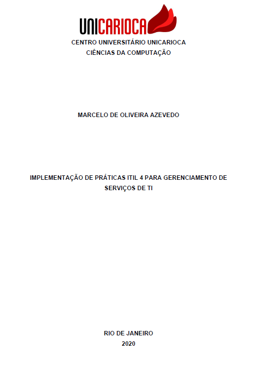

# Implementação de práticas ITIL 4 para Gerenciamento de serviços de TI

Trabalho de Conclusão de Curso apresentado ao Curso de Ciências da Computação do **[Centro Universitário Carioca](https://unicarioca.edu.br/)**, como requisito parcial para obtenção do grau de Bacharel em Ciências da Computação

---

Aluno: Marcelo de Oliveira Azevedo

Orientador: Alberto Tavares

---

  

